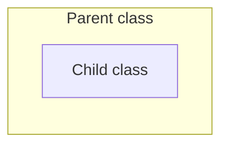
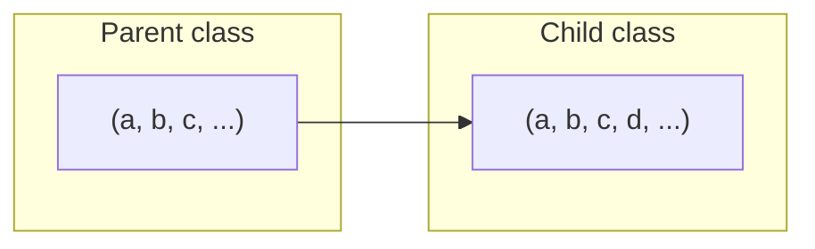
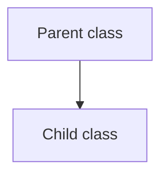
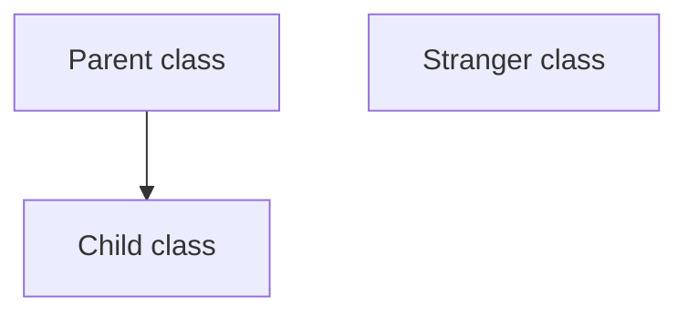

# サブタイピング多相と列多相について

## OOPにおけるclassの継承の考え方

OOPにおいて、集合におけるクラスの継承の包含関係は、以下のように考えることができる。

- `Parent`クラスは、`Child`クラスの親クラスである場合



また、データやメソッドを要素とした場合、継承の関係は以下のように考えることができる。

- `Parent`クラスは、`Child`クラスの親クラスである場合
  - `Child`クラスでは、`d`というデータを追加している

※継承すれば、親クラスのデータやメソッドは子クラスに全て引き継がれる。

`Parent class` ⊃ `Child class`の関係


これは一見っして、`Parent`クラスと`Child`クラスの包含関係が反対のように見える。
しかし、各クラスが少なくとも今持っている要素を全て持たなければいけない組を要素として持つ
集合と考えた場合は、すんなりとこの包含関係を認めることができる。

図で表現すると、以下のように考えるということである。

`Parent`クラスの組の条件が`Child`クラスの組の条件よりも緩いことが図からも明らかだろう。

(a,b,c, ...) ⊃ (a,b,c,d, ...)の関係



ここで理解すべきことは、`Parent`クラスの条件が`Child`クラスの条件よりも緩く、
常に`Parent`クラスが持つ要素は、現在の`Parent`クラスの要素を全て持った上で
**追加の要素を持つ**持ち得る可能性があるということである。

## サブタイピング多相と列多相に関するデータ欠損に関する話

サブタイピング多相と列多相をデータ欠損の観点から考えると、
以下のようなことが言える。

- サブタイピング多相 (データ欠損あり)

メソッドの引数の型によって、渡したインタンスが元々持っていたメソッドが呼び出せないことがある。

- 列多相 (データ欠損なし)

メソッドの引数の型によって、渡したインタンスが元々持っていたメソッドが呼び出せなくなることはない。

具体的なパターンを2つ挙げる。

今回は、サブタイピング多相の代表として `Java` を、列多相の代表として `OCaml` を例に挙げる。

コード全体は、`src/polymorphism`ディレクトリにある。

### 前提とする状況

今回の比較における前提として、以下のようなクラス構造を考える。

#### 継承関係



#### `Parent`クラス

`Parent`クラスは、`x`というフィールドと`getX()`メソッドを持つ。

- フィールド
  - `x` : `int`
- メソッド
  - `getX()` : `int`

- `Java`

```java
class Parent {
    final private int x;

    // Constructor
    public Parent(int x) {
        this.x = x;
    }

    // getX method
    public int getX() {
        return x;
    }
}
```

- `OCaml`

```ocaml
class parent (x0 : int) =
  object
    val x = x0
    method get_x = x
  end
```

#### `Child`クラス

`Parent`クラスを全て継承し、`y`というフィールドと`getY()`メソッドを追加する。

- フィールド
  - `x` : `int`
  - `y` : `int`
- メソッド
  - `getX()` : `int`
  - `getY()` : `int`

- `Java`

```java
class Child extends Parent {
    final private int y;

    // Constructor
    public Child(int x, int y) {
        super(x);
        this.y = y;
    }

    // getY method
    public int getY() {
        return y;
    }
}
```

- `OCaml`

```ocaml
class child (x0 : int) (y0 : int) =
  object
    inherit parent x0
    val y = y0
    method get_y = y
  end
```

### データ欠損のパターン

1. メソッド内部で引数で受け取ったインスタンスのメソッドを呼び出す場合

- `Java`

`Main`クラスに定義しているメソッド

```java
    // * 情報欠損するパターン1 * //
    // Parent型の変数に代入されたChildクラスのインスタンスを引数に取れる
    // しかし、ParentクラスにはgetY()メソッドがないため、エラーになる
    static void printXY(Parent human) {
        System.out.println("x: " + human.getX());
        // 以下はエラーになる。
        // * これが情報の欠損に値する。 * //
        // System.out.println("y: " + human.getY());
    }
```

`void printXY(Parent human)` メソッドは、
`Child`クラスのインスタンスを引数に取ることができる。
しかし、`Parent`クラスには`getY()`メソッドがないため、
`Child`クラスのインスタンスを引数に与えた場合でも、
`getY()`メソッドを呼び出すことができない。

これがサブタイプ多相の情報の欠損の一例である。

```java
public static void main(String[] args) {
    {
        // *** 情報欠損するパターン1 ***//
        // * Parentクラスのインスタンスを生成する場合 * //
        Parent parent = new Parent(0);
        // 以下は当然、情報の欠損は発生していない
        printXY(parent);

        // * Parentクラスと継承の関係になる場合 (Child class) * //
        Child child = new Child(1, 1);
        // 以下は実行可能
        System.out.println("x: " + child.getX());
        System.out.println("y: " + child.getY());

        // * ChildクラスはParentクラスを継承しているので、Parent型の変数に代入可能 * //
        // Child classのインスタンスを引数として与えたにも関わらず、`int getY()` メソッドが呼び出せない
        // これがサブタイプ多相の情報の欠損である
        printXY(child);
    }
}
```

- `OCaml`

```ocaml
(** Javaの情報欠損するパターン1に対応するもの **)
let printXY (human : < get_x : int ; .. >) =
  print_endline ("x: " ^ string_of_int human#get_x);
  (* 引数の型の要件じょりも厳しい要件のはずなのに、以下は問題なく実行できる *)
  (* get_y : int というメソッドを持つclassが引数に入っても、printXY内で問題なく使用できる -> データ欠損がないことを部分的に示している。 *)
  print_endline ("y: " ^ string_of_int human#get_y)
```

printXYの引数の型は、`< get_x : int ; .. >` であり、
`get_x`メソッドを持つクラスのインスタンスを引数に取るインスタンスならば、
どんな引数も受け取れる。
そのため、`Child`クラスのインスタンスを引数に与えることができる。
`get_X`メソッドを持つことを満たせさえすれば良いので、
`printXY(human: < get_x : int ; .. >)` の内部の処理で
追加のメソッド (この場合は、`get_y`) を持つインスタンスを引数に与えても問題ない。
結果として、`get_y`メソッドも持っていないインスタンスを引数に与えるとエラーとなる。

しかし、情報の欠損は発生していない。

```ocaml
let () =
  let parent = new parent 0 in
  let child = new child 1 1 in

  (* printXYでは、parent class が条件を満たしているにも関わらず、parent classのインスタンスを引数に取れない *)
  (* 以下は、エラーと判定される *)
  (* printXY parent; *)

  (* getY() メソッドも呼び出すことができる *)
  printXY child
```

2. メソッドの戻り値として引数で受け取ったインスタンスを返す場合

- `Java`

`Main`クラスに定義しているメソッド

```java
// * 情報欠損するパターン2 * //
static Parent throwClass(Parent human) {
    return human;
}
```

`void throwClass(Parent human)` メソッドは、
`Child`クラスのインスタンスを引数に取ることができる。
そして、`Parent`クラスの型の値を返す。
しかし、`Parent`クラスには`getY()`メソッドがないため、
`Child`クラスのインスタンスを引数に与えた場合でも、
戻り値の値からは`getY()`メソッドを呼び出すことができない。

これがサブタイプ多相の情報の欠損の一例である。

```java
public static void main(String[] args) {
    {
        // *** 情報欠損するパターン2 ***//
        // * Parentクラスのインスタンスを生成する場合 * //
        Parent parent = new Parent(0);
        // 以下は当然、情報の欠損は発生していない
        Parent returnedParent = throwClass(parent);
        System.out.println("returnedParent.x: " + returnedParent.getX());
        // 当たり前だが、以下は実行不可
        // Child returnedParent2 = throwChild(parent);
        // System.out.println("returnedParent2.x: " + returnedParent2.getX());
        // System.out.println("returnedParent2.y: " + returnedParent2.getY());

        // * Parentクラスと継承の関係になる場合 (Child class) * //
        Child child = new Child(1, 1);
        // 以下は実行可能
        System.out.println("x: " + child.getX());
        System.out.println("y: " + child.getY());

        // * ChildクラスはParentクラスを継承しているので、Parent型の変数に代入可能 * //
        // Child classのインスタンスを引数として与えたにも関わらず、`int getY()` メソッドが呼び出せない
        // これがサブタイプ多相の情報の欠損である
        Parent returnedChild = throwClass(child);
        System.out.println("returnedChild.x: " + returnedChild.getX());
        // 以下はエラーになる。
        // System.out.println("returnedChild.y: " + returnedChild.getY());
        // 当たり前だが、以下は実行可能
        Child returnedChild2 = throwChild(child);
        System.out.println("returnedChild2.x: " + returnedChild2.getX());
        System.out.println("returnedChild2.y: " + returnedChild2.getY());
    }
}
```

- `OCaml`

```ocaml
(** Javaの情報欠損するパターン2に対応するもの **)
let throwClass (human : < get_x : int ; .. >) : < get_x : int ; .. > = human
```

`throwClass`の引数の型は、`< get_x : int ; .. >` であり、
`get_x`メソッドを持つクラスのインスタンスを引数に取るインスタンスならば、
どんな引数も受け取れる。
そのため、`Child`クラスのインスタンスを引数に与えることができる。
そして、`< get_x : int ; .. >`型の値を返す。
`Child`クラスのインスタンスを引数に与えた場合は、
戻り値の値からは`get_y()`メソッドを呼び出すことができる。

したがって、`Child`クラスの情報の欠損は発生していない。

```ocaml
let () =
  let parent = new parent 0 in
  let child = new child 1 1 in

  (* throwClassでは、parent class が条件を満たしているので、parent classのインスタンスを引数に取れる *)
  (* 以下は、エラーと判定されない *)
  let returned_parent = throwClass parent in
  print_endline ("Returned parent x: " ^ string_of_int returned_parent#get_x);

  (* child classも条件を満たしているので、child classのインスタンスも引数に取れる *)
  (* 以下は、エラーと判定されない *)
  let returned_child = throwClass child in
  print_endline ("Returned child x: " ^ string_of_int returned_child#get_x);
  (* get_y : int が欠損することなく呼び出せている *)
  print_endline ("Returned child y: " ^ string_of_int returned_child#get_y)
```

## 構造的部分型 と 名前的部分型 の継承関係の明示度合いについて

- 構造的部分型 (非明示的な継承関係)

構造的部分型は、必要な型の要件を全て満たしているかどうかで型の互換性を判断する。
そのため、継承関係が明示的ではない。
ダックタイピングの原則に基づいたサブタイピングである。

- 名前的部分型 (明示的な継承関係)

名前的部分型は、構造が同じであっても明示的な継承関係の記述が必要。
そのため、継承関係が明示的である。

具体的なパターンを1つ挙げる。

今回は、構造的部分型の代表として `Java` を、名前的部分型の代表として `OCaml` を例に挙げる。

コード全体は、`src/subtyping/`ディレクトリにある。

### 前提とする状況

今回の比較における前提として、以下のようなクラス構造を考える。

#### 継承関係



#### `Parent`クラス

`Parent`クラスは、`x`というフィールドと`getX()`メソッドを持つ。

- フィールド
  - `x` : `int`
- メソッド
  - `getX()` : `int`

- `Java`

```java
class Parent {
    final private int x;

    // Constructor
    public Parent(int x) {
        this.x = x;
    }

    // getX method
    public int getX() {
        return x;
    }
}
```

- `OCaml`

```ocaml
class parent (x0 : int) =
  object
    val x = x0
    method get_x = x
  end
```

#### `Child`クラス

`Parent`クラスを全て継承し、`y`というフィールドと`getY()`メソッドを追加する。

- フィールド
  - `x` : `int`
  - `y` : `int`
- メソッド
  - `getX()` : `int`
  - `getY()` : `int`

- `Java`

```java
class Child extends Parent {
    final private int y;

    // Constructor
    public Child(int x, int y) {
        super(x);
        this.y = y;
    }

    // getY method
    public int getY() {
        return y;
    }
}
```

- `OCaml`

```ocaml
class child (x0 : int) (y0 : int) =
  object
    inherit parent x0
    val y = y0
    method get_y = y
  end
```

#### `Stranger`クラス

`Stranger`クラスは、`x`と`y`というフィールドと`getX()`と`getY()`メソッドを持つ。

- フィールド
  - `x` : `int`
  - `y` : `int`
- メソッド
  - `getX()` : `int`
  - `getY()` : `int`

- `Java`

```java
class Stranger {
    final private int x;
    final private int y    // * 継承関係のパターン * //
    static void inheritance(Child human) {
        System.out.println("x: " + human.getX());
        System.out.println("y: " + human.getY());
    };

    // Constructor
    public Stranger(int x, int y) {
        this.x = x;
        this.y = y;
    }

    // getX method
    public int getX() {
        return x;
    }

    // getY method
    public int getY() {
        return y;
    }
}
```

- `OCaml`

```ocaml
class stranger (x0 : int) (y0 : int) =
  object
    val x = x0
    val y = y0
    method get_x = x
    method get_y = y
  end
```

### 継承関係のパターン

- Java

`Main`クラスに定義しているメソッド

```java
// * 継承関係のパターン * //
static void inheritance(Child human) {
    System.out.println("x: " + human.getX());
    System.out.println("y: " + human.getY());
}
```

`inheritance`の引数の型は、`Child` であり、
`Child`と継承関係にない`Stranger`クラスのインスタンスを引数に与えることはできない。

したがって、意図せず`Stranger`クラスのインスタンスを引数に与えるという
事故は防げない。

```java
public static void main(String[] args) {
    Child child = new Child(0, 0);
    // 当たり前だが、以下は実行可能
    inheritance(child);

    Stranger stranger = new Stranger(1, 1);
    // 以下はエラーになる。
    // inheritance(stranger);
}
```

- OCaml

```ocaml
(** 継承関係のパターン **)
let inheritance (human : < get_x : int ; get_y : int ; .. >) =
  print_endline ("x: " ^ string_of_int human#get_x);
  print_endline ("y: " ^ string_of_int human#get_y)
```

`inheritance`の引数の型は、`< get_x : int ; get_y : int ; .. >` であり、
`get_x`メソッドと`get_y`メソッドを持つクラスのインスタンスを引数に取るインスタンスならば、
どんな引数も受け取れる。
そのため、`Child`クラスのインスタンスを引数に与えることができる。
そして、`Stranger`クラスのインスタンスも引数に取ることもできてしまう。

明示的な継承関係にないときも引数に与えることができるため、
`意図せず`Stranger`クラスのインスタンスを引数に与えるという
事故は防ぐことができる。

```ocaml
let () =
  let child = new child 0 0 in
  let stranger = new stranger 1 1 in
  inheritance child;
  (* parent classと継承関係にないにも関わらず、問題なく実行できてしまう *)
  inheritance stranger

```

## 考察

上記のプログラムにおいて、クラスの継承の関係を考えると、
`Java`のプログラムにおいても情報の欠損は発生してはいけないはずである。
しかし、`Java`のプログラムでは、情報の欠損が発生している。
サブタイピング多相を採用して、真のOOPを実現することは不可能ではないかと考える。

本来、`Parent`という型は、`< get_x : int ; .. >`という型でないといけないはずである。
しかし、`Parent`という型を引数に取るメソッドは、
関数の内部で`Parent`に存在しないメソッドを呼び出すことができない。
そのため、`Parent`という型は、事実上`< get_x : int ;>`という型になってしまっている。
これは、正しいOOPの考え方と言えるのか疑問である。

ただ、保守性や開発体験を考えると妥当な戦略だと考えることもできる。
